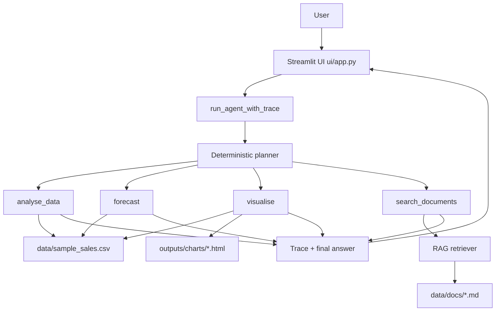

# sales-insight-agent

**An agentic AI sales analytics assistant that combines structured sales analysis, forecasting, visualisation, and document retrieval into one natural-language Streamlit interface.**

## 1. Project overview

`sales-insight-agent` is a local-first analytics assistant for commercial questions. It routes each user query to one or more deterministic tools and returns both an answer and a transparent execution trace.

The current system is deterministic and local-first; it does **not** call an LLM yet.

## 2. Why this project matters

Revenue teams often need answers that span numeric data and written business context. This project demonstrates a practical way to unify:

- structured sales analysis
- forecasting
- chart generation
- retrieval over business documents

in one chat workflow suitable for analyst and stakeholder demos.

## 3. Key features

- Deterministic tool planner with ordered multi-step tool chaining (max 5 calls).
- Natural-language Streamlit chat interface with persistent chat history.
- Tool trace visibility (`tools_used`, `intermediate_outputs`, `errors`, `iterations`).
- Structured analysis over synthetic-but-realistic sales data.
- Forecasting for revenue, units sold, and new customers.
- Plotly chart generation saved as local HTML under `outputs/charts/`.
- Document retrieval over sample business documents in `data/docs/`.
- Graceful unsupported-query and partial-failure handling.

## 4. Architecture

The UI calls `run_agent_with_trace`, which uses a deterministic planner to sequence tool execution and return a final answer plus trace.



See `docs/architecture.md` for a longer architecture walkthrough.

## 5. Tooling / tech stack

| Area | Stack |
|---|---|
| Orchestration | Python, deterministic planner in `agent/graph.py` |
| Data analysis | pandas |
| Forecasting | scikit-learn, numpy |
| Visualisation | Plotly |
| Retrieval | local retriever in `rag/` |
| UI | Streamlit |
| Testing | pytest |

## 6. Dataset and business documents

- **Dataset:** `data/sample_sales.csv` (synthetic but commercially realistic).
- **Documents:** markdown files in `data/docs/` used for retrieval.
- **Charts:** generated locally as HTML files in `outputs/charts/`.

## 7. How the agent works

1. User submits a question in Streamlit chat.
2. `run_agent_with_trace(query)` plans one or more tools in order.
3. Tools execute sequentially with bounded iterations and tool-call limit.
4. The agent returns:
   - `answer`
   - `tools_used`
   - `intermediate_outputs`
   - `errors`
   - `iterations`
5. UI renders answer, trace expanders, and charts when chart paths are present.

## 8. Example questions

Structured data analysis:

- `What is revenue by region?`

Forecasting:

- `Forecast revenue for the next month.`

Visualisation:

- `Show a chart of revenue by sales channel.`

Document search:

- `What does the market overview say about EMEA?`

Multi-step reasoning:

- `Search the docs for EMEA risks and forecast revenue for next month.`
- `Analyse EMEA Q3 softness and show a chart of revenue by region.`
- `What does the product strategy say, and show top products by revenue?`

## 9. How to run locally

From repo root:

```bash
python -m pytest
streamlit run ui/app.py
```

Then open the local Streamlit URL shown in the terminal.

## 10. Testing

Run the full test suite from repo root:

```bash
python -m pytest
```

## 11. Project structure

```text
sales-insight-agent/
  agent/
  tools/
  rag/
  ui/
    app.py
  data/
    sample_sales.csv
    docs/
  docs/
    architecture.md
    demo_script.md
  notebooks/
  outputs/
    charts/
  tests/
  config.py
  requirements.txt
  README.md
```

## 12. Current limitations

- No LLM integration yet (intentionally deterministic).
- Planner is keyword-based and deterministic, not semantic.
- Local file-based execution only; no deployment layer.
- Retrieval quality depends on sample docs and local indexing assumptions.

## 13. Future improvements

- Add optional LLM-backed planner/response synthesis behind a feature flag.
- Improve planner robustness for broader query phrasing.
- Add richer chart previews and downloadable artifacts.
- Add evaluation harnesses for retrieval and forecasting quality.
- Add deployment targets after deterministic baseline is finalized.
