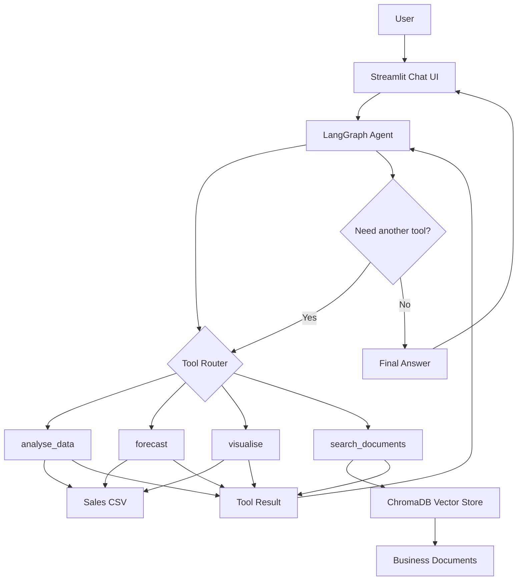

# sales-insight-agent

Agentic AI assistant for commercial sales analytics, built with LangGraph, RAG, forecasting, Plotly visualisation and a Streamlit chat interface.

## Project status

This repository is currently being built from a planned issue backlog. The README describes the target architecture, intended capabilities and delivery sequence. For the detailed build plan, see `plan.md`.

## What this project solves

Commercial teams often need to answer sales questions from multiple disconnected sources:

- structured sales data in CSVs, spreadsheets or warehouse tables
- written business documents such as quarterly reports, product briefs and market notes
- forecasting workflows that sit outside day-to-day reporting
- charts and summaries that have to be manually created for stakeholders

`sales-insight-agent` is designed to bring these workflows into one natural-language assistant. A user should be able to ask a business question and have the system decide whether to analyse the sales dataset, forecast future metrics, search business documents, generate a chart or combine multiple tools in sequence.

## Target capabilities

### 1. Sales data analysis

Ask natural-language questions over structured sales data.

Example questions:

```text
What is total revenue by region?
Which 5 products have the highest sales volume this quarter?
Show me the month-over-month revenue trend.
How does revenue differ by sales channel?
```

Primary tool: `analyse_data`

Expected output:

- formatted summaries
- grouped revenue or units tables
- top-N performance views
- date-filtered analysis
- friendly error handling for unsupported questions

### 2. Forecasting

Generate forward-looking forecasts from the sales dataset.

Example questions:

```text
Forecast revenue for the next 4 weeks.
What will units sold look like over the next quarter?
Forecast new customers for the next 30 days.
```

Primary tool: `forecast`

Expected output:

- point forecast
- P10, P50 and P90 estimates
- chronological train/test validation
- simple explanation of trend direction and uncertainty

### 3. Visualisation

Create charts on demand and surface them in the UI.

Example questions:

```text
Show me a bar chart of revenue by region.
Plot the sales trend as a line chart.
Give me a breakdown of units sold by product category as a pie chart.
```

Primary tool: `visualise`

Expected output:

- Plotly HTML charts
- valid local file paths
- chart titles and axis labels
- short business interpretation

### 4. Document search

Search business documents when numerical data alone is not enough.

Example questions:

```text
What does the quarterly report say about growth targets?
Find mentions of the EMEA region in our sales documents.
What were the key risks highlighted in the market overview?
```

Primary tool: `search_documents`

Expected output:

- retrieved text snippets
- source document names
- relevance scores
- low-confidence result handling

### 5. Multi-step agent reasoning

Answer questions that require multiple tools.

Example questions:

```text
Compare last quarter's revenue to the forecast, then show me a chart of the gap.
Find what the sales report says about EMEA, then pull the actual numbers for that region.
```

Expected route examples:

```text
analyse_data -> forecast -> visualise -> final answer
search_documents -> analyse_data -> final answer
```

## Target architecture



## Planned project structure

```text
sales-insight-agent/
  agent/
  tools/
  rag/
  data/
  data/docs/
  ui/
  notebooks/
  tests/
  config.py
  requirements.txt
  .env.example
  plan.md
  README.md
```

## Tech stack

| Area | Tools |
|---|---|
| Agent orchestration | LangGraph, LangChain tool interfaces |
| LLM integration | Anthropic Claude API |
| Structured data analysis | pandas |
| Forecasting | LightGBM, scikit-learn, statsmodels |
| RAG and retrieval | ChromaDB, sentence-transformers or Anthropic embeddings |
| Visualisation | Plotly |
| UI | Streamlit |
| Testing | pytest |

## Quick start

This section will become fully runnable once the implementation phases are complete.

Planned local flow:

1. Clone the repository.
2. Create and activate a Python virtual environment.
3. Install dependencies from `requirements.txt`.
4. Copy `.env.example` to `.env` and add the required API credentials.
5. Run the Streamlit app from `ui/app.py`.
6. Rebuild the vector store with the RAG ingestion module when documents change.
7. Run tests with `pytest`.

## Implementation roadmap

The build should be delivered through focused PRs in this order:

| PR | Issue | Theme | Reason |
|---:|---|---|---|
| 1 | #1 | Repo scaffolding and dataset | Creates the foundation for every later issue |
| 2 | #2 | LangGraph agent skeleton | Establishes the agent loop and tool interfaces |
| 3 | #3 | Structured sales analysis | First real business capability |
| 4 | #5 | Plotly visualisation | Makes analysis visible and UI-ready |
| 5 | #4 | Forecasting | Adds the strongest data science layer |
| 6 | #6 | RAG ingestion and retrieval | Creates the document intelligence backend |
| 7 | #7 | Document search tool | Wires RAG into the agent |
| 8 | #8 | Multi-step reasoning | Requires all real tools to exist first |
| 9 | #9 | Streamlit chat UI | Presents the working agent to users |
| 10 | #10 | README, architecture and demo notebook | Final portfolio packaging |

See `plan.md` for the detailed work order, acceptance gates and PR-level implementation notes.

## Portfolio positioning

This project is intended to demonstrate:

- practical agentic AI implementation
- commercial analytics product thinking
- structured data analysis through natural language
- forecasting with validation and uncertainty bands
- RAG over business documents
- transparent tool use and explainable agent behaviour
- a usable interface for non-technical users

The final version should read as a portfolio-grade AI analytics assistant, not a generic chatbot.
