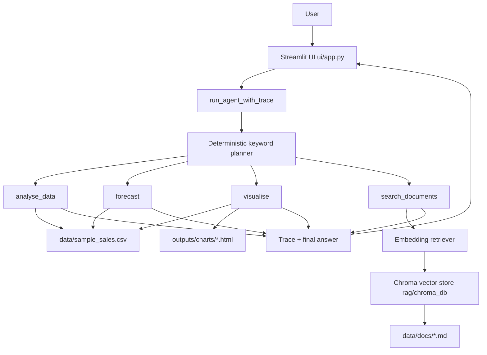

# sales-insight-agent

[](https://github.com/varunrout/sales-insight-agent/actions/workflows/ci.yml)

**A deterministic tool-routing sales analytics assistant: it routes each natural-language question to structured analysis, forecasting, visualisation, or embedding-based document retrieval, and returns an answer with a transparent execution trace, in one Streamlit interface.**

## Headline (read this first)

To keep the claims and the code honest:

- **It is not an LLM agent.** Routing is a deterministic, keyword-driven planner in `agent/graph.py`, not a language model. The word "agent" here means ordered tool chaining, not autonomy or reasoning by an LLM. There is no LLM in the run path.
- **Document retrieval is genuinely semantic.** `rag/` embeds document chunks with `all-MiniLM-L6-v2` (via Chroma's default ONNX embedding function) and stores them in a persistent Chroma vector store. Retrieval is cosine nearest-neighbour search with a calibrated similarity floor, not token overlap. It matches on meaning: *"why did EMEA sales dip in the third quarter"* retrieves the "EMEA Q3 revenue softness" chunk despite sharing almost no words with it. See `docs/modeling/retrieval_threshold.md`.
- **The data is synthetic.** `data/sample_sales.csv` is generated, commercially shaped demo data, not a real company's numbers.
- **Dependencies match the code.** `requirements.txt` lists only what actually runs.

## 1. Project overview

`sales-insight-agent` is a local-first analytics assistant for commercial questions. It routes each user query to one or more deterministic tools and returns both an answer and a transparent execution trace.

## 2. Why this project matters

Revenue teams often need answers that span numeric data and written business context. This project demonstrates a practical way to unify:

- structured sales analysis
- forecasting
- chart generation
- semantic retrieval over business documents

in one chat workflow suitable for analyst and stakeholder demos.

## 3. Key features

- Deterministic tool planner with ordered multi-step tool chaining (max 5 calls).
- Streamlit chat interface with persistent chat history over a fixed set of supported question shapes.
- Tool trace visibility (`tools_used`, `intermediate_outputs`, `errors`, `iterations`).
- Structured analysis over synthetic-but-realistic sales data.
- Forecasting for revenue, units sold, and new customers.
- Plotly chart generation saved as local HTML under `outputs/charts/`.
- Embedding-based semantic document retrieval over the documents in `data/docs/`, backed by a persistent Chroma vector store.
- Graceful unsupported-query and partial-failure handling.

## 4. Architecture

The UI calls `run_agent_with_trace`, which uses a deterministic planner to sequence tool execution and return a final answer plus trace.



See `docs/architecture.md` for a longer architecture walkthrough.

## 5. Tooling / tech stack

| Area | Stack |
|---|---|
| Orchestration | Python, deterministic keyword planner in `agent/graph.py` |
| Data analysis | pandas |
| Forecasting | scikit-learn (`HistGradientBoostingRegressor`), numpy |
| Visualisation | Plotly |
| Retrieval | Chroma vector store + `all-MiniLM-L6-v2` embeddings (`rag/`) |
| UI | Streamlit |
| Testing | pytest, ruff |

## 6. Dataset and business documents

- **Dataset:** `data/sample_sales.csv` (synthetic but commercially realistic; not gitignored so the demo runs on clone).
- **Documents:** markdown files in `data/docs/` embedded into the vector store.
- **Vector store:** built to `rag/chroma_db/` (gitignored, rebuilt from the docs).
- **Charts:** generated locally as HTML files in `outputs/charts/`.

## 7. How the agent works

1. User submits a question in Streamlit chat.
2. `run_agent_with_trace(query)` plans one or more tools in order.
3. Tools execute sequentially with bounded iterations and tool-call limit.
4. The agent returns `answer`, `tools_used`, `intermediate_outputs`, `errors`, `iterations`.
5. UI renders answer, trace expanders, and charts when chart paths are present.

## 8. Example questions

Structured data analysis:

- `What is revenue by region?`

Forecasting:

- `Forecast revenue for the next month.`

Visualisation:

- `Show a chart of revenue by sales channel.`

Document search:

- `What does the market overview say about EMEA?`

Multi-step reasoning:

- `Search the docs for EMEA risks and forecast revenue for next month.`
- `Analyse EMEA Q3 softness and show a chart of revenue by region.`
- `What does the product strategy say, and show top products by revenue?`

## 9. How to run locally

From repo root:

```bash
pip install -r requirements.txt
python -m scripts.build_vector_store   # embeds data/docs into rag/chroma_db (first run downloads the embedding model)
python -m pytest
streamlit run ui/app.py
```

Then open the local Streamlit URL shown in the terminal.

## 10. Testing and quality

```bash
python -m pytest          # test suite
ruff check .              # lint
ruff format --check .     # format check
```

CI runs lint, format check, the vector-store build, and the test suite on every push and pull request. A `.pre-commit-config.yaml` mirrors the lint/format hooks; run `pre-commit install` to enable them locally.

## 11. Project structure

```text
sales-insight-agent/
  agent/            deterministic planner, intent parsing, state
  tools/            analyse_data, forecast, visualise, search_documents
  rag/              ingest, embedding retriever, Chroma vector store
  scripts/          build_vector_store
  ui/app.py         Streamlit chat interface
  data/             sample_sales.csv, docs/, sample_questions.json
  docs/             architecture, modeling notes, demo script
  tests/
  config.py
  requirements.txt
```

## 12. Current limitations

- No LLM integration (intentionally deterministic).
- The planner is keyword-based, not semantic; it answers a fixed set of question shapes and returns an unsupported message otherwise.
- Forecasting reports backtest MAE/RMSE but is not yet compared against a seasonal-naive baseline, and interval coverage is not yet measured.
- Routing accuracy and retrieval hit-rate are not yet captured as committed evaluation numbers.
- Local file-based execution only; no deployment layer.

## 13. Future improvements

- Add a seasonal-naive baseline and interval-coverage check to the forecaster.
- Add an evaluation harness over `data/sample_questions.json` for routing accuracy and retrieval hit-rate, and publish the numbers.
- Add an optional LLM-backed planner/response synthesis behind a feature flag.
- Add deployment targets after the deterministic baseline is finalised.
