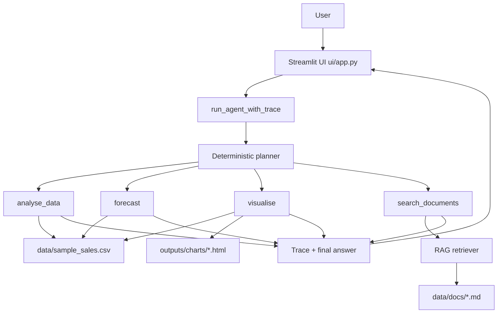

# Architecture

This document describes the current deterministic, local-first architecture of `sales-insight-agent`.

## System view

## Runtime flow

1. Streamlit receives a user question via `st.chat_input`.
2. UI calls `run_agent_with_trace(query)`.
3. The deterministic planner selects an ordered tool list from:
   - `analyse_data`
   - `forecast`
   - `visualise`
   - `search_documents`
4. Tools execute sequentially (bounded by iteration and tool-call limits).
5. A trace object is returned with:
   - `answer`
   - `tools_used`
   - `intermediate_outputs`
   - `errors`
   - `iterations`
6. UI renders final answer, trace details, and chart HTML output when present.

## Data boundaries

- Structured analytics and forecasting use `data/sample_sales.csv`.
- Document retrieval uses sample business documents under `data/docs`.
- Charts are generated to local files under `outputs/charts`.

## Design constraints

- Deterministic routing for repeatable outputs.
- Local-first operation.
- No LLM calls in the current version.
